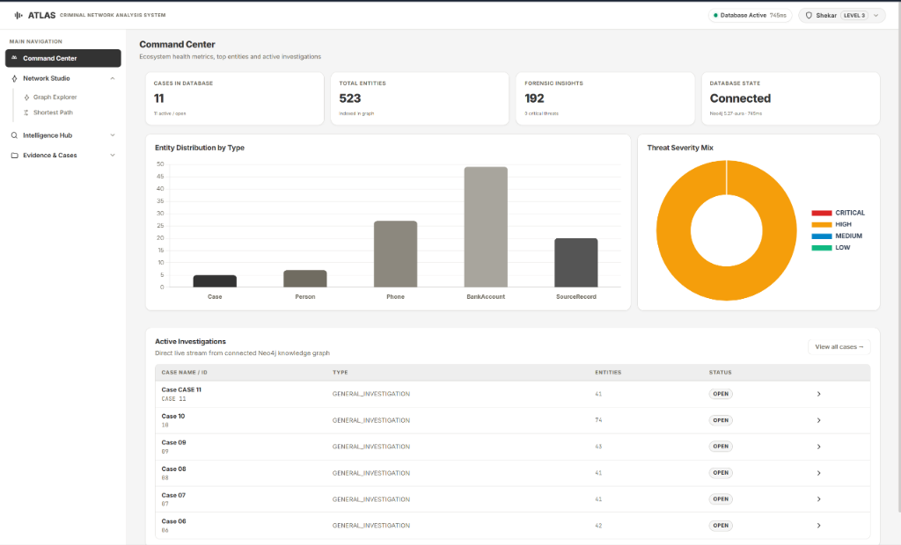
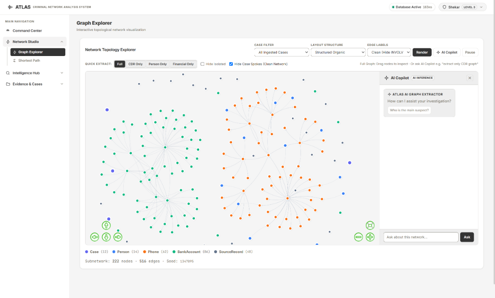
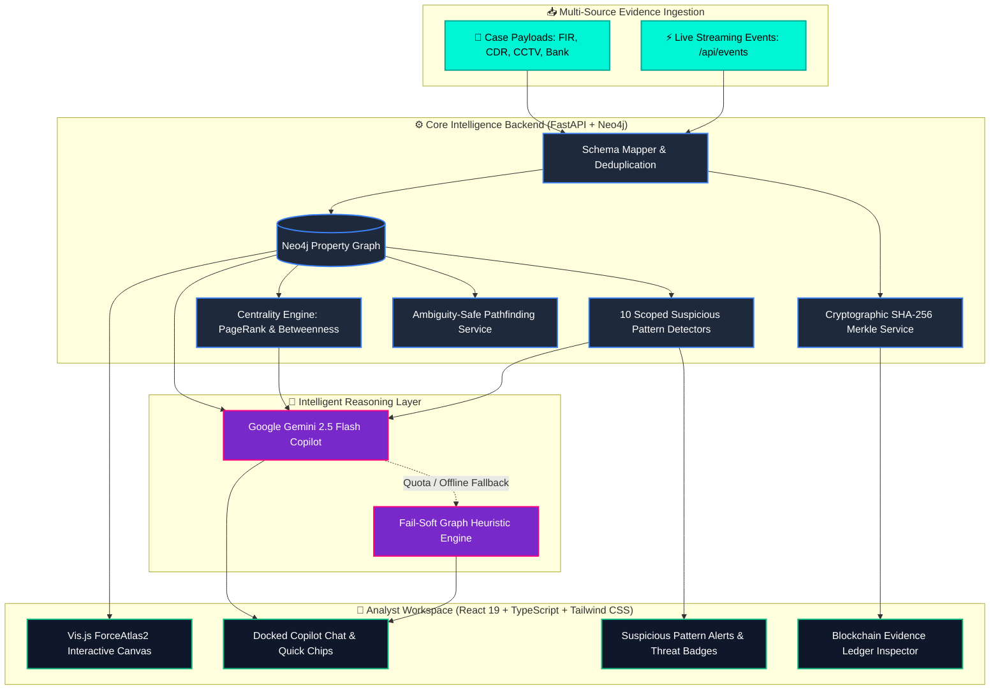

<div align="center">

<!-- ═══════════════════════════════════════════════════════════════════ -->
<!-- 🎖️ TACTICAL FORENSIC GRAPH HUD                                      -->
<!-- ═══════════════════════════════════════════════════════════════════ -->
<a href="#-reproducible-3-minute-evaluator-demo">
  
</a>

<br/>

<!-- ═══════════════════════════════════════════════════════════════════ -->
<!-- 📡 PROTOTYPE VERIFICATION CAPSULES                                  -->
<!-- ═══════════════════════════════════════════════════════════════════ -->
<p align="center">
  
  
  
  
  
</p>
<p align="center">
  
  
  
  
  
</p>

---

<p align="center">
  <b>An AI-assisted criminal network analysis prototype engineered for law enforcement, intelligence analysts, and cyber-crime task forces.<br/>
  Harmonizes fragmented multi-jurisdiction records (FIRs, CDRs, CCTV ANPR, Banking Wires) into a property graph, executes 10 algorithmic Cypher detectors, anchors forensic integrity in a hash-chained SHA-256 ledger, and assists investigators via an interactive Gemini 2.5 Flash Graph Copilot with offline heuristic fallback.</b>
</p>

</div>

---

## 📑 Command Center Navigation

| 🎨 [Frontend](frontend/README.md) | ⚙️ [Backend](backend/README.md) | 📂 [Dataset](dataset/README.md) | 🧪 [Tests](tests/README.md) | 🔒 [Blockchain](data/README.md) | 📑 [Documentation](docs/README.md) |
| :---: | :---: | :---: | :---: | :---: | :---: |
| React 19 + TypeScript + Tailwind CSS | FastAPI & Cypher Engine | Multi-Modal Forensic Files | 211 Passing Tests | SHA-256 Merkle Ledger | Technical Specifications |

---

## 🖥️ Live Prototype Dashboard Interface

The interactive single-page analyst workspace built with **React 19**, **TypeScript (strict mode)**, and **Tailwind CSS**, bundled via **Vite 5**:

<div align="center">
  
  <p><i>Figure 1: Analyst Command Center Dashboard displaying ecosystem metrics, active FIR investigations, entity distribution histograms, and threat severity breakdown.</i></p>
</div>

<br/>

---

## ⚡ Reproducible 3-Minute Evaluator Demo Script

Judges and evaluators can verify the complete end-to-end investigative workflow in under 3 minutes using the bundled forensic datasets:

```
[Step 1: Start System] ──► [Step 2: Ingest Case 001] ──► [Step 3: Ingest Case 002 (Bridge Discovered)]
                                                                    │
[Step 6: Verify Ledger] ◄── [Step 5: Query Gemini Copilot] ◄── [Step 4: Run 10 Detectors]
```

### Step 1: Launch the Application
```powershell
# Option A: Docker Compose (Spins up Neo4j + FastAPI)
docker-compose up -d

# Option B: Native Local
uvicorn backend.main:app --reload
```
Open your browser to: **`http://localhost:8000`**

### Step 2: Ingest Case 001 (Homicide Investigation)
```powershell
Invoke-RestMethod -Uri "http://localhost:8000/api/cases/ingest" -Method Post -InFile "dataset/case_001_homicide.json" -ContentType "application/json"
```
*Result*: Populates FIR details, suspect phone calls, and vehicle sightings for incident `CASE-2024-001`.

### Step 3: Ingest Case 002 (Corporate Hawala Fraud)
```powershell
Invoke-RestMethod -Uri "http://localhost:8000/api/cases/ingest" -Method Post -InFile "dataset/case_002_fraud.json" -ContentType "application/json"
```
*Evaluator Observation*: Notice how the graph autonomously discovers a **cross-case bridge**! Target **`Vikram Singh`** connects the homicide case directly to the financial laundering syndicate.

### Step 4: Execute 10 Scoped Cypher Pattern Detectors
```powershell
Invoke-RestMethod -Uri "http://localhost:8000/api/insights" -Method Get
```
*Evaluator Observation*: Returns 10 detected patterns in milliseconds, flagging Hawala layering, Burner SIM swapping, and cell tower co-location.

### Step 5: Interrogate the Gemini AI Copilot
Click the **"Ask AI"** button on the dashboard or query via REST API:
```powershell
Invoke-RestMethod -Uri "http://localhost:8000/api/graph/ai-query" -Method Post `
  -Body '{"query": "Summarize key suspects and explain how funds are being moved across cases."}' `
  -ContentType "application/json"
```
*Evaluator Observation*: The Copilot synthesizes graph topology, PageRank scores, and transaction chains into plain investigative language. *(If no API key is provided, the built-in heuristic fallback responds instantly with zero errors!)*

### Step 6: Verify Cryptographic Evidence Integrity
```powershell
Invoke-RestMethod -Uri "http://localhost:8000/api/blockchain/verify" -Method Get
```
*Evaluator Observation*: Returns `{"status": "VALID", "total_blocks": 3}`, confirming the SHA-256 hash-chained Merkle ledger is intact.

---

## 🎯 Suspect Dossier & Network Centrality Matrix

In forensic investigations, the system does not claim guilt; rather, it **ranks structurally significant entities and suspicious communication/financial patterns for investigator review**.

<div align="center">
  
</div>

<br/>

### How Entity Resolution is Handled (Preventing False Matches)
To prevent incorrect identity merging, the prototype uses **deterministic primary business keys**:
- **Phone Numbers**: E.164 MSISDN international format.
- **Hardware**: Device IMEI / MAC identifiers.
- **Financial Accounts**: Normalized IFSC + Account Number pairs.
- **Government Identifiers**: PAN / Aadhaar / Passport unique hash keys.
- **Vehicles**: State Registration / License Plate numbers.

*(Entities with matching business keys are merged; entities without shared keys remain distinct nodes for investigator review).*

---

## 🤖 Gemini 2.5 Flash Graph Copilot

Field investigators and detectives do not have time to construct complex Cypher graph queries. The **Gemini 2.5 Flash Copilot** is docked directly inside the interactive canvas (`#graphAiPanel`), translating human questions into instant topological and forensic intelligence.

<div align="center">
  
  <p><i>Figure 2: Interactive ForceAtlas2 Graph Topology with docked Gemini AI Copilot chat drawer and quick prompt chips.</i></p>
</div>

<br/>

<div align="center">
  
</div>

<br/>

### ⚡ One-Click Autonomous Prompt Chips
- 🔍 **Summarize Key Suspects**: Isolates primary syndicate operatives, aliases, and charge sheets.
- 💸 **Find Laundering Rings**: Traces structured layering across nominee mule accounts.
- 🌐 **Explain Cross-Case Connections**: Identifies overlapping entities connecting disconnected FIRs.
- 👑 **Who is the Central Kingpin?**: Analyzes PageRank and bridge betweenness centrality.

---

## 🔑 Gemini API Key Configuration & Dual-Mode Fallback

The platform uses Google Gemini 2.5 Flash. You can obtain a free key and rotate it at any time with zero downtime.

### Step 1: Obtain a Free Key
1. Visit **[Google AI Studio](https://aistudio.google.com/app/apikey)**.
2. Sign in with any Google account.
3. Click **"Create API Key"** and copy your token.

### Step 2: Configure in `.env`
Edit or create your `.env` file in the project root:
```ini
# .env
GEMINI_API_KEY=AIzaSyYourGeneratedGeminiKeyHere
GEMINI_MODEL=gemini-2.5-flash
```

### Step 3: Restart Backend
```powershell
uvicorn backend.main:app --reload
```

---

### 🛡️ Dual-Mode Intelligence & Failover Mechanics
> [!NOTE]
> **What happens if your free Gemini credit expires or Google returns HTTP 429 Quota Exceeded?**
>
> The system implements a **fail-soft heuristic architecture** (`backend/services/gemini_service.py`):
> 1. If the API key is missing, expired, or rate-limited, the system **never crashes, never fails, and displays zero error alerts**.
> 2. It immediately shifts to an internal **Deterministic Graph Heuristics Engine**:
>    - Dynamically evaluates node degree centrality, PageRank, and betweenness scores.
>    - Scans active pattern detections (Hawala, SIM swaps, co-locations).
>    - Generates a structured, evidence-backed investigative briefing directly in the chat panel.
> 3. Once a new valid key is provided in `.env`, the system automatically resumes utilizing Gemini 2.5 Flash.

---

## 🕵️ The 10 Scoped Cypher Pattern Detectors

Continuous, case-scoped graph algorithms engineered to identify suspicious patterns for human investigator verification:

<div align="center">
  
</div>

<br/>

| # | Detector Name | Threat Level | Algorithmic Mechanism |
| :-: | :--- | :-: | :--- |
| **1** | **Frequent Caller Spikes** |  | Detects communication volume outliers (>30 calls) between unassociated nodes in short intervals. |
| **2** | **Burner SIM / IMEI Multi-Swap** |  | Traces multiple phone numbers registered to or transmitting through identical physical IMEI hardware. |
| **3** | **Hawala & Laundering Rings** |  | Detects rapid-succession funds transfers traversing 3+ intermediary accounts to obscure origin. |
| **4** | **Mule Account Syndicates** |  | Flags historically dormant accounts suddenly receiving high-velocity, high-sum deposits. |
| **5** | **Cross-Case Suspect Overlap** |  | Pinpoints identical person nodes, vehicles, or bank accounts present across separate FIRs. |
| **6** | **Vehicle Convoy Tracking** |  | Identifies pairs or groups of vehicles logged at identical CCTV ANPR cameras within 5-minute margins. |
| **7** | **Crime Scene Co-Location** |  | Matches cell tower sector connections of multiple suspects within the temporal window of an FIR. |
| **8** | **Meeting & Association Clusters** |  | Calculates network clique density to discover co-accused meeting clusters. |
| **9** | **Shell Company / Dummy Address Rings** |  | Detects multiple commercial legal entities registered to identical physical postal addresses. |
| **10** | **Centrality Leaderboard** |  | Executes PageRank & Betweenness Centrality to isolate network commanders vs. logistics mules. |

---

## 📊 Graph Centrality: Revealing Structural Significance

Relational SQL queries only count raw totals (e.g. *number of calls or transactions*). In real-world syndicates, core coordinators purposely keep low call volumes, relying on intermediaries.

By calculating **Betweenness Centrality** and **PageRank**, the graph engine isolates entities that act as structural bridges between otherwise disconnected clusters:

<div align="center">
  
</div>

<br/>

---

## 🔒 Cryptographic Chain of Custody (Hash-Chained Ledger)

To support legal admissibility standards (e.g., Section 65B of the Indian Evidence Act / BSA guidelines), the system implements a **local hash-chained evidence ledger**:

<div align="center">
  
</div>

<br/>

- **Deterministic SHA-256 Merkle Roots**: All entities and relationships in an ingested payload are normalized and hashed into a Merkle root tree.
- **Cryptographic Hash Chaining**: Every block contains the `previous_hash` of its predecessor. Altering a past record invalidates every subsequent block.
- **Tamper Verification**: Call `GET /api/blockchain/verify` to validate ledger integrity anytime.

---

## 📋 What is Actually Implemented? (Prototype Scope & Roadmap)

To maintain rigorous engineering integrity, here is the exact breakdown of implemented prototype components vs. production roadmap:

| Capability | Status | Implementation Details |
| :--- | :---: | :--- |
| **Multi-Modal Graph Ingestion** | 🟢 **Implemented** | Normalizes FIRs, CDRs, Bank Wires, and CCTV ANPR into Neo4j property graph. |
| **10 Scoped Cypher Detectors** | 🟢 **Implemented** | Automated Cypher algorithms for Hawala, Burner SIMs, convoys, and co-locations. |
| **Gemini 2.5 Flash Copilot** | 🟢 **Implemented** | Natural language graph synthesis via official Google GenAI SDK. |
| **Heuristic Fallback Engine** | 🟢 **Implemented** | Rule-based topology summarizer ensuring 100% offline uptime without API credits. |
| **Hash-Chained Custody Ledger** | 🟢 **Implemented** | SHA-256 Merkle root block generator with tamper-verification API. |
| **Automated Test Suite** | 🟢 **Implemented** | 211 passing unit & integration tests running completely offline in ~1.2 seconds. |
| **React 19 + TypeScript Frontend** | 🟢 **Implemented** | Fully typed `.tsx` codebase with `strict: true`, typed props/state/refs, and zero `any` leaks. Built with Vite 5. |
| **Tailwind CSS Integration** | 🟢 **Implemented** | Utility-first CSS framework with custom Atlas design tokens, glassmorphism, and neomorphic components. |
| **Interactive Web Dashboard** | 🟢 **Implemented** | Vis.js ForceAtlas2 network explorer with docked Copilot chat drawer. |
| **Deterministic Entity Matching**| 🟡 **Prototype Scope** | Strict primary key matching (Phone, IMEI, Account, PAN) to eliminate false merges. |
| **Distributed Consensus** | 🔵 **Future Roadmap** | Multi-node Raft/PBFT consensus across separate agency jurisdictions. |
| **Probabilistic Fuzzy NER** | 🔵 **Future Roadmap** | Legal NER fine-tuning for resolving fuzzy suspect name variants. |

---

## 🛠️ Technology Stack

| Layer | Technology | Version | Purpose |
| :--- | :--- | :---: | :--- |
| **Frontend Framework** | React | 19.x | Component-based SPA with hooks and strict mode |
| **Type System** | TypeScript | 5.6 | `strict: true`, typed props/state/refs/events across all `.tsx` files |
| **CSS Framework** | Tailwind CSS | 3.4 | Utility-first styling with custom Atlas design tokens |
| **Bundler** | Vite | 5.x | Lightning-fast HMR and optimized production builds (`tsc && vite build`) |
| **Graph Visualization** | Vis.js Network | 9.1 | ForceAtlas2-based interactive network canvas |
| **Charts** | Chart.js | 4.4 | Bar and doughnut charts for ecosystem metrics |
| **Backend** | FastAPI | 0.100+ | Async Python REST API with Pydantic v2 validation |
| **Graph Database** | Neo4j Aura | 5.27 | Cloud-hosted property graph with Cypher query engine |
| **AI Copilot** | Google Gemini | 2.5 Flash | Natural language graph intelligence with heuristic fallback |
| **Evidence Integrity** | SHA-256 | — | Hash-chained Merkle root ledger for chain of custody |
| **Testing** | Pytest | 9.1 | 211 unit & integration tests, 100% offline execution |

---

## 🏛️ System Architecture Pipeline



---

## 🧪 Comprehensive Verification Suite

Run all 211 unit and integration tests completely offline:

```powershell
pytest tests/unit tests/integration
```

```text
============================= test session starts =============================
platform win32 -- Python 3.14.0, pytest-9.1.1
rootdir: C:\Users\shinc\projects\AI-Powered-Criminal-Network-Analysis-System
collected 211 items

tests\unit\test_ai_insights.py .....                                     [  2%]
tests\unit\test_batched_relationship_writers.py .....................    [ 12%]
tests\unit\test_blockchain_ledger.py ....                                [ 14%]
tests\unit\test_case_delete.py ......                                    [ 17%]
tests\unit\test_delta_processor.py ................                      [ 24%]
tests\unit\test_entity_search.py .....                                   [ 27%]
tests\unit\test_event_model.py ...............                           [ 34%]
tests\unit\test_insights_10_types.py ..........                          [ 38%]
tests\unit\test_logging_masking.py ...                                   [ 40%]
tests\unit\test_rankings.py ....                                         [ 42%]
tests\unit\test_scoped_detectors.py .................................... [ 59%]
......................                                                   [ 69%]
tests\unit\test_shortest_path.py ......                                  [ 72%]
tests\integration\test_events_api.py .........................           [ 84%]
tests\integration\test_health_and_reset.py ....                          [ 86%]
tests\integration\test_ingest_merge.py ....                              [ 88%]
tests\integration\test_ingest_ordering.py ......                         [ 90%]
tests\integration\test_ingest_replace.py ..                              [ 91%]
tests\integration\test_legacy_ingest_casedata.py ................        [ 99%]
tests\integration\test_unified_ingest.py .                               [100%]

====================== 211 passed in 1.22s =======================
```

---

## 📂 Repository File Structure

```
AI-Powered-Criminal-Network-Analysis-System/
├── README.md                           # ⭐ Main Showcase & System Overview
├── .env.example                        # Safe environment template
├── .gitignore                          # Strict security exclusion for secrets & caches
├── docker-compose.yml                  # Neo4j + Backend container orchestration
├── Dockerfile                          # Multi-stage production container build
├── pytest.ini                          # Pytest configuration
├── requirements.txt                    # Pinned production dependencies
│
├── frontend/                           # 🎨 React 19 + TypeScript + Tailwind CSS Application
│   ├── index.html                      # SPA entry point (loads /src/main.tsx)
│   ├── package.json                    # Dependencies & build scripts (tsc && vite build)
│   ├── tsconfig.json                   # TypeScript strict configuration
│   ├── tsconfig.node.json              # TypeScript config for Vite
│   ├── tailwind.config.ts              # Tailwind CSS theme & design tokens
│   ├── postcss.config.js               # PostCSS pipeline (Tailwind + Autoprefixer)
│   ├── vite.config.ts                  # Vite 5 bundler configuration
│   ├── src/
│   │   ├── main.tsx                    # React 19 entry point
│   │   ├── App.tsx                     # Root component with typed state & routing
│   │   ├── index.css                   # Tailwind directives + custom glassmorphism styles
│   │   ├── vite-env.d.ts               # TypeScript module declarations
│   │   ├── services/
│   │   │   └── api.ts                  # Typed API client & domain interfaces
│   │   └── components/
│   │       ├── Sidebar.tsx             # Navigation sidebar & topbar
│   │       ├── OverviewModule.tsx      # Command Center with Chart.js analytics
│   │       ├── GraphExplorerModule.tsx # Vis.js ForceAtlas2 interactive graph
│   │       ├── EntitySearchModule.tsx  # Multi-property entity search
│   │       ├── ShortestPathModule.tsx  # Path analysis between entities
│   │       ├── RankingsModule.tsx      # Centrality rankings (PageRank, Betweenness)
│   │       ├── PatternInsightsModule.tsx # 10 forensic pattern detectors
│   │       ├── BlockchainModule.tsx    # SHA-256 chain of custody ledger
│   │       ├── CaseRegistryModule.tsx  # Case management & entity breakdown
│   │       ├── DataIngestionModule.tsx # JSON/CSV/narrative ingestion
│   │       └── Modals.tsx             # Entity detail & AI dossier modals
│   ├── dist/                           # Production build output (committed for deployment)
│   └── README.md                       # 👉 Detailed Frontend Guide
│
├── backend/                            # ⚙️ FastAPI Graph Intelligence Engine
│   ├── main.py                         # Application entrypoint & static routes
│   ├── database.py                     # Neo4j driver connection pool
│   ├── config.py                       # Settings & environment validation
│   ├── logging_config.py               # Structured logging with PII masking
│   ├── models/                         # Pydantic v2 schemas (Entities, Events, Insights)
│   ├── routers/                        # REST API endpoint controllers
│   ├── services/                       # Graph writers, Detectors, Blockchain & AI
│   └── README.md                       # 👉 Detailed Backend Architecture Guide
│
├── dataset/                            # 📂 Forensic Case Evidence Payloads
│   ├── case_001_homicide.json          # Multi-source homicide case (FIR, CDR, CCTV)
│   ├── case_002_fraud.json             # Corporate fraud with cross-case overlap
│   ├── envelope_sample.json            # Real-time streaming event envelope
│   └── README.md                       # 👉 Forensic Dataset & Ingestion Guide
│
├── tests/                              # 🧪 Automated Test Suite (211+ Passing Tests)
│   ├── unit/                           # Isolated unit tests
│   ├── integration/                    # API & pipeline integration tests
│   ├── live/                           # Live Neo4j equivalence tests
│   ├── conftest.py                     # Mock fixtures & blockchain test isolation
│   └── README.md                       # 👉 Testing Suite Guide & Commands
│
├── data/                               # 🔒 Cryptographic Blockchain Ledger
│   ├── blockchain_ledger.json          # Verifiable chain-of-custody blocks
│   └── README.md                       # 👉 Blockchain & Tamper-Proofing Guide
│
└── docs/                               # 📑 Technical Specifications & Runbooks
    ├── assets/                         # 🎨 High-Res Vector SVG HUD Visuals & Screenshots
    │   ├── command_center_dashboard.png # Command Center overview & active cases
    │   ├── dashboard_live_demo.png     # Graph Explorer & docked Gemini Copilot
    │   ├── classified_hud_banner.svg   # Level-4 Top Secret HUD with Radar & Frequency Waves
    │   ├── tactical_dossier.svg        # Classified Suspect Dossier & Biometric Laser Scan
    │   ├── copilot_terminal.svg        # Glassmorphism Copilot Interaction Window
    │   ├── detectors_grid.svg          # 10 Cypher Pattern Detectors Dashboard
    │   ├── centrality_radar_chart.svg  # Mathematical Graph Centrality Spider Chart
    │   └── blockchain_pipeline.svg     # Cryptographic Merkle Chain Flow
    ├── EVENTS_API.md                   # Real-time event streaming specification
    ├── SUMMARY.md                      # Comprehensive system architecture & entity model
    ├── SYSTEM_ARCHITECTURE_AND_OPERATIONS_GUIDE.md # Production runbook & failover guide
    └── README.md                       # 👉 Documentation Index & Roadmap
```

---

<div align="center">

<p align="center">
  <b>Built for the Smart India Hackathon (SIH) &bull; National Law Enforcement Innovation</b><br/>
  <i>Empowering investigators with Graph AI, Cryptographic Integrity, and Explainable Reasoning.</i>
</p>

</div>
